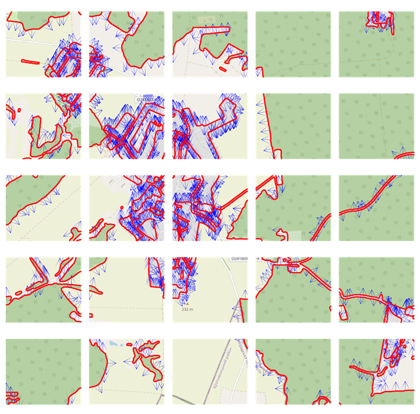
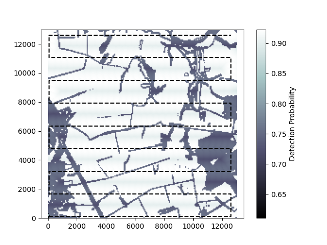
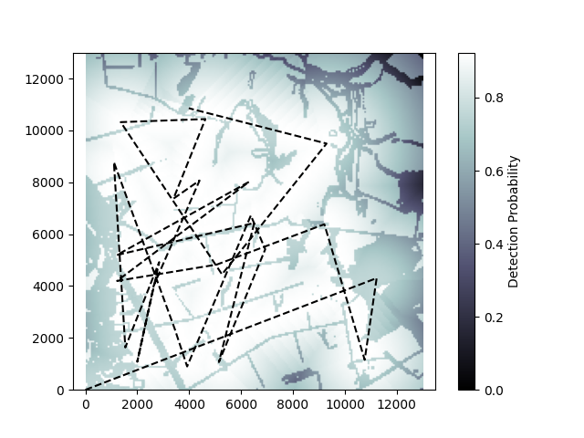

# Optimization of Drone Search Paths

Winning Entry of the 2025 Munich EDTH Quantum Systems Challenge for aireal search path optimization for drones. The objective is to find flight paths that:

- are hard to predict

- minimize flight time

- maximize chance to detect targets

<!-- https://docs.google.com/document/d/10NAXI8iBlvttn55pvaIu82eoPAoTxwcrjRPxcSlMt1k/edit?usp=sharing -->

# Features

- Terrain feature extraction and analysis of feature opacity from satellite images, as well as edge detection to determine from which side to view buildings and forests
- Drone simulator capable of calculating overall detection coverage probability, based on terrain features and modeling drone camera behavior.  
- Initial path guess based on physical dynamics and brownian motion.
- Optimization drone flight paths based on cumulative detection probability across an entire area using state-of-the-art global optimization algorithms.

# Animations & Plots

Here are some example animations and plots.

    
     
     extracted map information including terrain information, terrain accessibility, edge detection

    
    
     
     Left: Naive drone search path implementation with a lawnmower pattern. 
    Right: Optimized drone search path. Compared to naive approach, by our benchmarks, this path minimizes expected target detection time by 23%, while mainting same path length

    
    
      
    Left: simulation of the drones overall detection cone. Right: Cumulative detection probability over the drones flight path

<!-- 

    
    
     
    Left: simulation of the drones current camera view. Right: Cumulative detection probability of the drones flight path and camera movement

 -->

# Contributors

- [JKKDY](https://github.com/JKKDY)
- [missing-user](https://github.com/missing-user)
- [RiaRosenauer](https://github.com/RiaRosenauer)
- [schwarzfischer1776](https://github.com/schwarzfischer1776)

